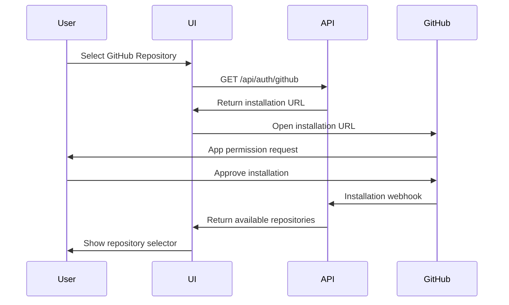
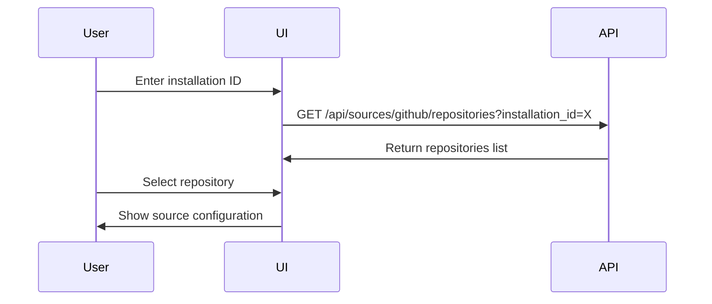
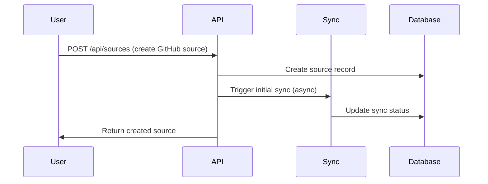
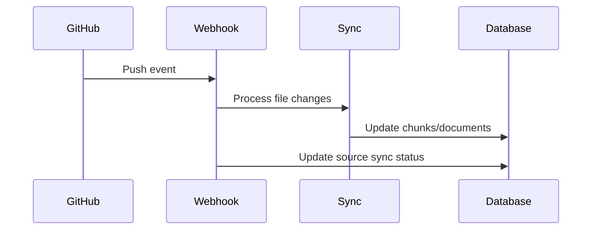

# GitHub Source Integration

This document outlines the comprehensive GitHub integration for the TNEGA Knowledge Base project, which allows users to connect their GitHub repositories as sources and automatically sync code/documentation.

## Overview

The GitHub integration uses a GitHub App approach instead of personal access tokens, providing better security, fine-grained permissions, and webhook capabilities.

### Key Features

- ✅ **GitHub App Authentication**: Secure OAuth flow instead of manual tokens
- ✅ **Repository Selection**: Interactive UI to select specific repositories
- ✅ **Automatic Webhooks**: Real-time sync on code changes
- ✅ **Manual Sync**: Trigger sync operations manually
- ✅ **Installation Management**: Handle app installation/removal events
- ✅ **Sync Status Tracking**: Real-time status updates and error handling

## Architecture

### Components

1. **GitHub App Configuration** (`src/github.ts`)
   - App initialization with credentials
   - Installation-based authentication

2. **API Endpoints**
   - `/api/auth/github` - GitHub OAuth initiation
   - `/api/sources/github/repositories` - Repository listing
   - `/api/sources/github/install` - Bulk source creation
   - `/api/sources/[sourceId]/sync` - Manual sync operations

3. **UI Components**
   - `GitHubRepositorySelector` - Repository selection interface
   - `SourceForm` - Enhanced with GitHub App flow
   - `SourceSyncStatus` - Sync status monitoring

4. **Webhook Handlers** (`src/webhook/handlers.ts`)
   - Installation events
   - Repository changes
   - Push events

5. **Sync Engine** (`src/sync.ts`)
   - Full repository indexing
   - Incremental updates
   - Content chunking and embedding

## User Flow

### 1. Initial Setup

Users can add GitHub as a source through two methods:

#### Method A: Single Repository (via SourceForm)
1. Select "GitHub" as source type
2. Click "Select GitHub Repository"
3. Install GitHub App (opens GitHub)
4. Select single repository
5. Configure path filters and sync options
6. Create source

#### Method B: Bulk Installation
1. Navigate to GitHub App installation URL
2. Install app and select repositories
3. Use `/api/sources/github/install` to create multiple sources

### 2. Authentication Flow



### 3. Repository Selection



### 4. Source Creation & Sync



### 5. Webhook Processing



## Configuration

### Environment Variables

```bash
# GitHub App Configuration
GITHUB_APP_ID=your_app_id
GITHUB_APP_PRIVATE_KEY=your_private_key
GITHUB_WEBHOOK_SECRET=your_webhook_secret
```

### GitHub App Settings

Required permissions:
- **Repository permissions:**
  - Contents: Read
  - Metadata: Read
  - Pull requests: Read (optional)
  
- **Webhook events:**
  - Installation
  - Installation repositories  
  - Push

### Database Schema

The `sources` table supports GitHub integration with the following config structure:

```json
{
  "installation_id": 12345678,
  "repository": "owner/repo-name",
  "repository_id": 87654321,
  "default_branch": "main",
  "private": false,
  "path": "docs/",  // optional path filter
  "auto_sync": true
}
```

## API Reference

### GET /api/auth/github
Initialize GitHub App installation flow.

**Query Parameters:**
- `installation_id` (optional) - Process completed installation
- `setup_action` (optional) - Handle setup completion

**Response:**
```json
{
  "installation_url": "https://github.com/apps/your-app/installations/new",
  "state": "org_123_user_456"
}
```

### GET /api/sources/github/repositories
Get repositories for an installation.

**Query Parameters:**
- `installation_id` (required) - GitHub App installation ID

**Response:**
```json
{
  "installation": {
    "id": 12345678,
    "account": { "login": "username" }
  },
  "repositories": [
    {
      "id": 87654321,
      "name": "repo-name",
      "full_name": "owner/repo-name",
      "description": "Repository description",
      "private": false,
      "default_branch": "main"
    }
  ]
}
```

### POST /api/sources/github/install
Create sources for multiple repositories.

**Request Body:**
```json
{
  "installation_id": 12345678,
  "repositories": [
    {
      "id": 87654321,
      "name": "repo-name",
      "full_name": "owner/repo-name",
      "description": "Repository description",
      "private": false,
      "default_branch": "main"
    }
  ]
}
```

### POST /api/sources/[sourceId]/sync
Manually trigger sync for a source.

**Response:**
```json
{
  "message": "Sync triggered successfully",
  "source_id": 123,
  "status": "syncing"
}
```

### GET /api/sources/[sourceId]/sync
Get sync status for a source.

**Response:**
```json
{
  "source_id": 123,
  "sync_status": "completed",
  "last_synced_at": "2023-12-01T10:00:00Z",
  "sync_error": null,
  "is_active": true
}
```

## Sync Process

### Initial Sync
When a GitHub source is created:

1. **Status Update**: Set `sync_status` to "syncing"
2. **Repository Tree**: Fetch complete file tree from default branch
3. **Content Processing**: Download and process each file
4. **Chunking**: Split content into searchable chunks
5. **Embedding**: Generate vector embeddings for chunks
6. **Storage**: Save documents and chunks to database
7. **Status Update**: Set `sync_status` to "completed" or "failed"

### Incremental Sync (Webhooks)
On push events:

1. **Diff Analysis**: Compare `before` and `after` commit SHAs
2. **File Processing**: Handle added/modified/deleted files
3. **Content Update**: Update chunks for changed files
4. **Cleanup**: Remove chunks for deleted files
5. **Status Update**: Update source `last_synced_at`

### Content Filtering
- **Binary Files**: Automatically skipped (images, executables, etc.)
- **Size Limits**: Files > 1.5MB are skipped
- **Gitignore**: Respects repository `.gitignore` patterns
- **Path Filters**: Optional user-defined path restrictions

## Error Handling

### Common Error Scenarios

1. **Installation Removed**: Deactivate all related sources
2. **Repository Access Revoked**: Mark specific sources as failed
3. **Rate Limiting**: Implement exponential backoff
4. **Network Issues**: Retry with timeout
5. **Content Too Large**: Skip with warning
6. **Invalid Configuration**: Clear error messages

### Monitoring

The system tracks:
- Sync status per source
- Last sync timestamp
- Error messages and stack traces
- Webhook delivery status
- Rate limit consumption

## Security Considerations

### GitHub App Benefits
- **Principle of Least Privilege**: Only request needed permissions
- **Installation Scoping**: Users control which repositories are accessible
- **Token Management**: No manual token storage/rotation
- **Audit Trail**: GitHub provides installation activity logs

### Data Protection
- **Encrypted Storage**: Sensitive config data encrypted at rest
- **Access Control**: Organization-level isolation
- **Webhook Verification**: HMAC signature validation
- **Rate Limiting**: Prevent abuse

## Future Enhancements

### Planned Features
- [ ] **Branch Selection**: Support for multiple branches
- [ ] **PR Integration**: Index pull request content
- [ ] **Issue Tracking**: Sync GitHub issues as searchable content
- [ ] **Advanced Filtering**: More granular content selection
- [ ] **Batch Operations**: Bulk sync management
- [ ] **Analytics**: Sync performance metrics

### Optimizations
- [ ] **Parallel Processing**: Concurrent file processing
- [ ] **Smart Caching**: Avoid re-processing unchanged content
- [ ] **Selective Sync**: Only sync modified file sections
- [ ] **Compression**: Reduce storage footprint

## Troubleshooting

### Common Issues

1. **"Installation not found"**
   - Verify app is still installed
   - Check installation ID is correct
   - Ensure organization has access

2. **"Repository access denied"**
   - Verify repository is included in installation
   - Check if repository was made private
   - Confirm user has admin access

3. **"Sync failing repeatedly"**
   - Check webhook delivery in GitHub settings
   - Verify webhook secret matches
   - Review error logs for specific issues

4. **"No content being indexed"**
   - Check path filters aren't too restrictive
   - Verify files aren't binary or too large
   - Review gitignore exclusions

### Debug Commands

```bash
# Check installation status
curl -X GET "/api/sources/github/repositories?installation_id=12345"

# Trigger manual sync
curl -X POST "/api/sources/123/sync"

# Check sync status
curl -X GET "/api/sources/123/sync"
```

## Conclusion

This GitHub integration provides a robust, secure, and user-friendly way to connect GitHub repositories as knowledge base sources. The webhook-based approach ensures content stays up-to-date automatically, while the GitHub App model provides superior security and user experience compared to personal access tokens.

The modular architecture allows for easy extension to support additional features and platforms in the future.
